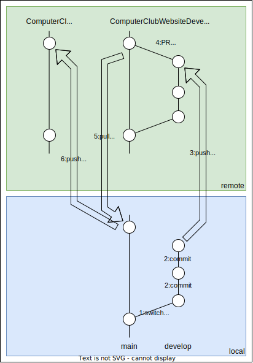

# 概要
- SSG:hugo
- Theme:[PaperMod](https://github.com/adityatelange/hugo-PaperMod)
-  Repozitory:[Develop](https://github.com/NCT-Wakayama-College/ComputerClubWebsiteDevelop), [Public](https://github.com/NCT-Wakayama-College/ComputerClubWebsite)

# 開発環境を整える
1. [公式ホームページ](https://juggernautjp.info/installation/)を参考にhugoをインストール
2. リポジトリをクローンし、`hugo server`で開発用サーバーを起動させる
    ```shell
    $ git clone --recursive https://github.com/NCT-Wakayama-College/ComputerClubWebsiteDevelop.git
    $ cd ComputerClubWebsiteDevelop
    $ hugo server
    ```
3. 起動した開発用サーバーにアクセすることが確認できれば、開発環境を整えられている

# 記事を投稿


コンピュータ部のWebサイトは2つのリポジトリを用いて開発を進める。ComputerClubWebsiteとComputerClubWebsiteDevelopというリポジトリである。ComputerClubWebsiteDevelop/mainとComputerClubWebsite/mainは常に同期させている。

## 一般権限の場合
一般的な権限を持っている部員が、記事を投稿する場合の手順を示す。既に[開発環境を整える](#開発環境を整える)の作業を終えているとする。
1. ComputerClubWebsiteDevelopのmainブランチから任意のブランチに派生させ、そのブランチにチェックアウトする(図の1)
   - `git switch -C develop`でブランチの作成、切り替えができる
2. 記事を記述し、コミットを行う(図の2)
   - `hugo new content posts/2024/XXX.md`とターミナルに入力すると、XXXというタイトルの記事が作成される
   - `XXX.md`の先頭に記述されている`author`には記事を書いた人を、`tags`に適切なタグを設定する
   - 記事自体はMarkdown形式で記述する
3. 作業したブランチをリモートリポジロリにプッシュしてGitHubに反映させる(図の3)
   - `git push origin develop`
4. GitHubのPullRequestを使い、mainにsquash mergeする(図の4)
   - この時、レビュアーに少なくとも一人は管理者権限を持っている人を割り当てること
5. 後はレビュアーに修正を求められたら修正する。それ以降は管理者権限を持っている人がWebサイトに反映してくれるので、気長に待つ

## 管理者権限の場合
1. ComputerClubWebsiteのリポジトリをリモートリポジトリとして登録する
   - `git remote add public https://github.com/NCT-Wakayama-College/ComputerClubWebsite.git`
2. ComputerClubWebsiteDevelopのmainブランチをプルする(図の5)
   - `git pull origin main`
3. ComputerClubWebsiteのmainブランチにプッシュする(図の6)
   - `git push public main`
4. デプロイまで正しくできていることをGitHubで確認する

# プロフィールを投稿
プロフィールを投稿する場合は、上記の[記事を投稿->一般権限の場合](#一般権限の場合)の手順2以外は同じです。手順2の`hugo new content posts/2024/XXX.md`の部分を`hugo new content members/2022B-NAME.md`に読み替えてください。
