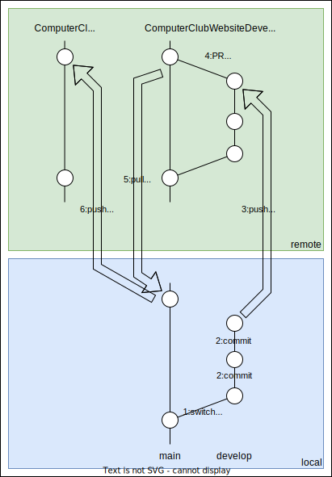
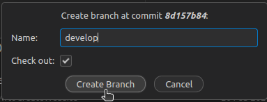
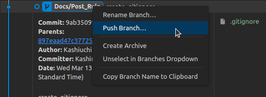
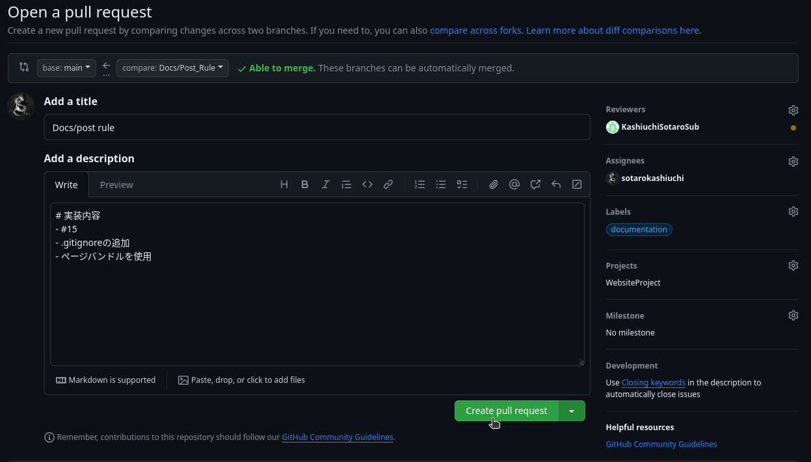
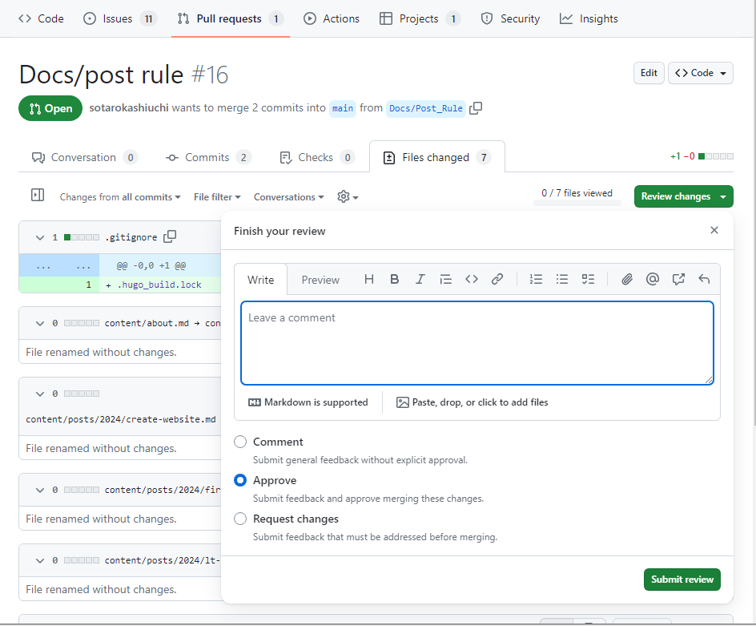

# 概要
- SSG:hugo
- Theme:[PaperMod](https://github.com/adityatelange/hugo-PaperMod)
-  Repozitory:[Develop](https://github.com/NCT-Wakayama-College/ComputerClubWebsiteDevelop), [Public](https://github.com/NCT-Wakayama-College/ComputerClubWebsite)

# 開発環境を整える
1. [公式ホームページ](https://juggernautjp.info/installation/)を参考にhugoをインストール
2. リポジトリをクローンし、`hugo server`で開発用サーバーを起動させる
    ```shell
    $ git clone --recursive https://github.com/NCT-Wakayama-College/ComputerClubWebsiteDevelop.git
    $ cd ComputerClubWebsiteDevelop
    $ hugo server
    ```
3. 起動した開発用サーバーにアクセすることが確認できれば、開発環境を整えられている

# 記事を投稿


コンピュータ部のWebサイトへ記事を投稿するには大きく2つのステップを踏む必要がある。1つ目はComputerClubWebsiteDevelopという開発用のリポジトリに記述した記事を投稿(マージ)すること。2つ目はmainとComputerClubWebsiteという本番環境のリポジトリにComputerClubWebsiteDevelopの変更を取り入れること。  
ステップ1の段階では、コンピュータ部の部員だけがGitHubから閲覧できる状態であり、ステップ2で世界中に公開される。またステップ1はコンピュータ部の部員であれば誰でも行うことが可能だが、ステップ2はGitHubへの書き込み権限を持っている人しか行うことができない。

## ステップ1
ComputerClubWebsiteDevelopという開発用のリポジトリに記述した記事を投稿(マージ)する手順を示す。既に[開発環境を整える](#開発環境を整える)の作業を終えているとする。
1. ComputerClubWebsiteDevelopのmainブランチから任意のブランチに派生させ、そのブランチにチェックアウトする(図の1)
   - [CUI] `git switch -C develop`でブランチの作成、切り替えができる
   - [VSCode] Git Graphを開き、「Create Branch...」をクリック  
      
   - [VSCode] 「Name」に適切なブランチ名を指定し、「Check out」にチェックをつけ、「Create Branch」をクリック  
      
2. 記事を記述し、コミットを行う(図の2)
   - `hugo new content posts/2024/XXX/index.md`とターミナルに入力すると、XXXというタイトルの記事が作成される
   - `content/posts/2024/XXX/index.md`の記事の詳細な書き方を参考にして記事を書く。
   - 変更をコミットする。
3. 作業したブランチをリモートリポジロリにプッシュしてGitHubに反映させる(図の3)
   - [CUI]`git push origin develop`
   - [VSCode]Git Graphを開き、先程のブランチを右クリックし、「Push Branch...」をクリックし、「Yes Push」をクリック  
      
4. PullRequestを作成する
   - この時、レビュアーに少なくとも一人は管理者権限を持っている人を割り当てること
   - 
5. レビュアーに修正を求められたら修正する。それ以降は管理者権限を持っている人がWebサイトに反映してくれるので、気長に待つ

## ステップ2
1. PullRequestのレビューを行う
   - 
1. mainに「**quash merge**」する(図の4)
   - 
2. ComputerClubWebsiteのリポジトリをリモートリポジトリとして登録する
   - `git remote add public https://github.com/NCT-Wakayama-College/ComputerClubWebsite.git`
3. ComputerClubWebsiteDevelopのmainブランチをプルする(図の5)
   - `git pull origin main`
4. ComputerClubWebsiteのmainブランチにプッシュする(図の6)
   - `git push public main`
5. デプロイまで正しくできていることをGitHubで確認する

# プロフィールを投稿
プロフィールを投稿する場合は、上記の[記事を投稿->一般権限の場合](#一般権限の場合)の手順2以外は同じです。手順2の``hugo new content posts/2024/XXX/index.md`の部分を`hugo new content members/2022B-NAME.md`に読み替えてください。
