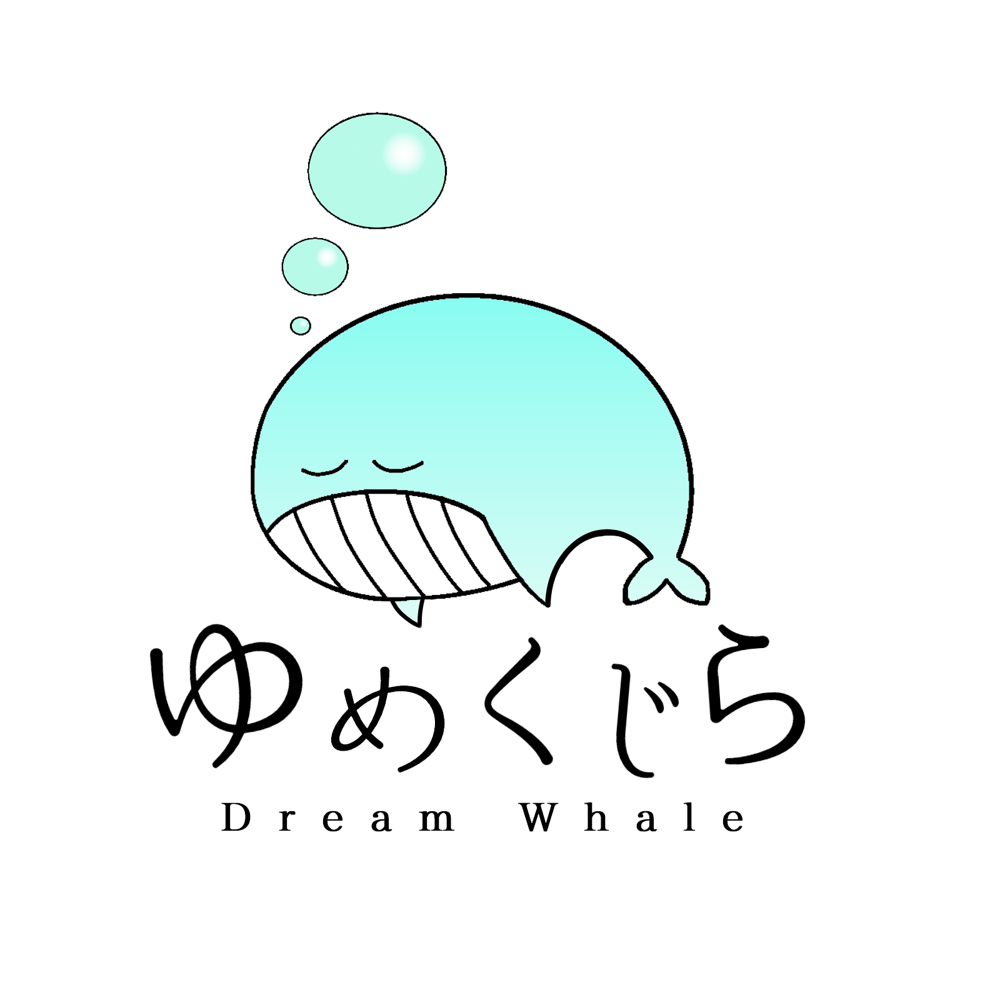
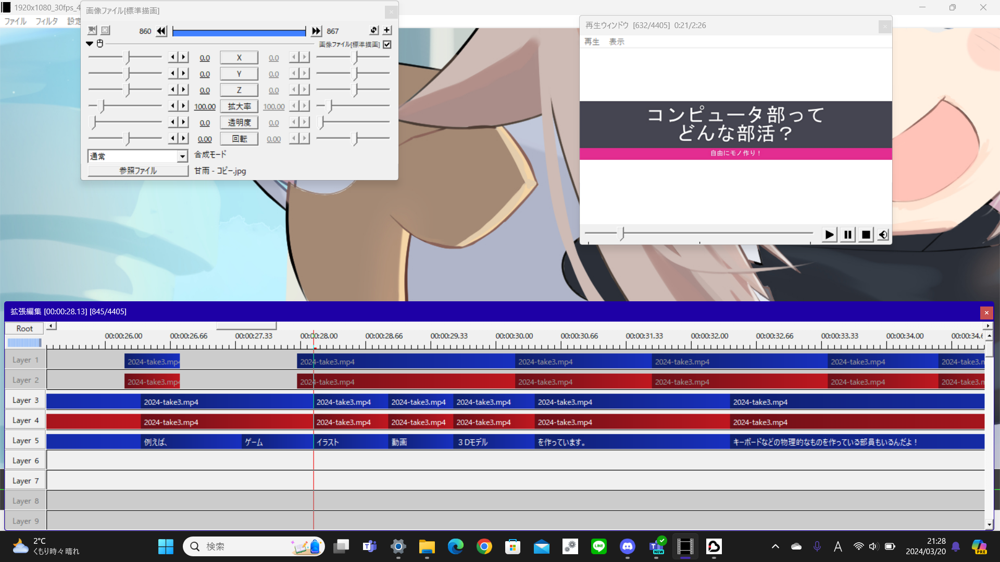
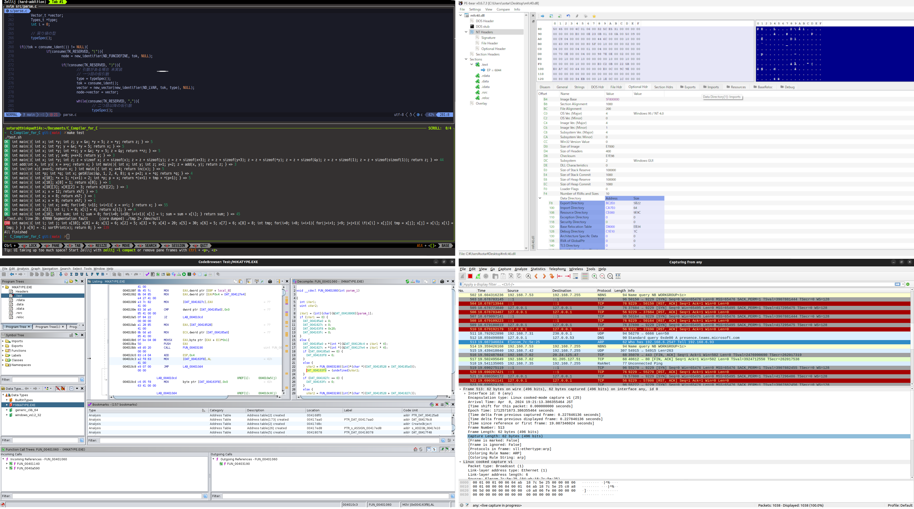

# コンピュータ部とは
私達コンピュータ部は、和歌山工業高等専門学校(National College of Technology, Wakayama College)の情報系のクラブです。2024年度から本校の「ゆめくじら」というサークルと合併し、新体制で運営しています。

  

# ミッション
1. **初めの一歩をサポートして、お互いに刺激しあい、モチベーションを維持できるコミュニティになる。最終的に、独学し成長できる人間になることを目標とする。**  
現在インターネットが普及し、誰もが自由に学べる時代になりました。特に情報系の分野では無料で技術的な記事が公開されていたり、新しい技術が紹介されていたりと独学で学びやすい環境が整っています。そのため、独学できる人は自分でどんどんと成長することが可能であり、無限の可能性を秘めています。そこで、コンピュータ部では最終的に独学で成長できる人間になることを目指します。
しかしながら、独学をするまでの第一歩を踏み出すのが難しいと思っている学生が多いのが現状です。また、独学をしてもモチベーションを維持できないという人も多くいます。コンピュータ部では勉強会やLT会、交流会を開催したり、チームでの開発を行ったりし、これらの課題を乗り越えようとしています。

2. **他学年や卒業生、企業の方々との交流の場となり、イベント・技術の情報を得たり、自分の将来像について考えたりできる機会を提供する。**  
将来像が見えなければ、何から手をつけてよいかわからず、計画も立てることができません。コンピュータ部では、将来像を見つけるために、年齢を超えた他学年の交流や、学校を超えた社会人の方々との交流を大切にしています。視野を広げ、将来像を見つける機会を提供していきます。

3. **技術を習得するだけでなく、その技術を用いて「どのように社会に貢献できるか？」という視点を身に付ける。**  
身につけた技術はいろいろなことに応用することができます。社会課題に対して技術を応用できれば、社会がよりよくなっていくでしょう。コンピュータ部では、多くの人と交流し、技術の応用方法や、社会課題に触れ、多くの視点を持てるようになることを目指します。

# 沿革
| 年   | 沿革                            |
| ---- | ------------------------------- |
| 2024 | ゆめくじらとコンピュータ部 合併 |
| 2024 | セキュリティ部門 設置           |

# 組織図

# ゆめくじら

ゆめくじらは、主将、副主将、会計、企画委員、広報委員、ゆめくじらメンバで構成されています。  
主な活動内容は、コンピュータ部の全体の方針を決めることです。クラブ紹介や、クラブ見学などを取りまとめたり、予算の管理などを行っています。また勉強会の企画や、LT会の企画、交流会の企画なども行っています。  
ゆめくじらの会議はオープンで、部員なら誰でも参加することができます。

# 部門紹介
## ゲーム制作部門
ゲーム制作部門では主にUnityを用いて開発を行っています。

## 動画制作部門
動画制作部門では、各々が自分の作りたい動画を計画し、さまざまな種類の動画をつくっています。”可不”や”ずんだもん”の素材を使った解説動画や、ゲーム実況動画などがよくつくられています。また、コンピュータ部のクラブ紹介動画([上記動画](#コンピュータ部とは))や、和高専の学科紹介動画を協同してつくったこともあります。  
　我々は、動画制作は解説動画だけに収まるものではないと考えていて、現在では、MVやアニメーションなどの、これまでとは違った趣向の動画を実現しようと試みています。

<!-- ToDo:

 -->

## デジタルアート部門
デジタルアート部門では主にイラスト、3DCGなどを制作しています。コンピュータ部バーチャル部長「和歌宮らみな」の原案や、VRCHATのワールドである「Virtual ICT Room」はこの部門のメンバーが制作したものです。デジタルアート部門のメンバーそれぞれが、自分の個性を発揮して、思い思いの創作活動を行っています。
機材としてはwacom製の液タブを三台所有しており、自由に使用できます。（ただし1週間単位での貸し出し）

## 音楽制作部門
音楽を作っています。

## セキュリティ部門
近年、サイバーセキュリティの重要性がますます高まっています。IoT、VR、AR、AIなど様々な技術が浸透してくる中、セキュアなシステムがより求められるでしょう。そこで、コンピュータ部では2024年度から新たに、セキュリティ部門を設置しました。
セキュリティの分野は幅広く、リバースエンジニアリング、マルウェア解析、暗号解読、ウェブセキュリティ、ネットワークセキュリティなど多岐に渡ります。この部門に所属する部員には、一つの分野を極めた人や、多方面を広く学んだ人などと様々です。

### 活動内容
セキュリティ部門の主な活動を紹介します。

1. **守る対象について学ぶ**  
セキュリティは何かを守るための技術です。そのため守る対象物について熟知している必要があります。1つ目の活動では守る対象物への理解を深めるために、自作CPU、自作OS、自作コンパイラの作成、Webアプリの開発、IT分野の資格取得などを行っています。

1. **イベント・勉強会に参加する**  
セキュリティの技術は日々進歩します。そこで最新の技術を取り入れたり、コミュニティを広げるためにも、積極的に外部のイベントや、勉強会に参加しています。

2. **セキュリティコンテストに出場する**  
身につけた技術を使い、セキュリティのコンテストなどにも参加しています。コンテストに参加することで、自分の実力を知れるだけでなく、自分の弱点を知るきっかけにもなります。

