+++
title = 'ゆめくじらとコンピュータ部の合併'
date = 2024-04-01T00:00:00+09:00
description = ''
categories = 'news'
tags = ['クラブ体制']
author = ['KashiuchiSotaro']
+++

和歌山高専には情報系のサークルとして「ゆめくじら」、情報系のクラブとして「コンピュータ部」という2つの団体があります。  
本日、2024年4月1日付で、ゆめくじらとコンピュータ部が合併することとなりました。
合併後の組織の体制としては以下の図のとおりです。(2024年4月1日現在)

※和歌山高専では部長は教員のことを指し、学生の長は主将と呼ぶ

ゆめくじらとコンピュータ部、それぞれの得意分野や、特徴を活かすとともに、協力して情報系の分野を盛り上げていきます。  
今後ともよろしくおねがいします。
