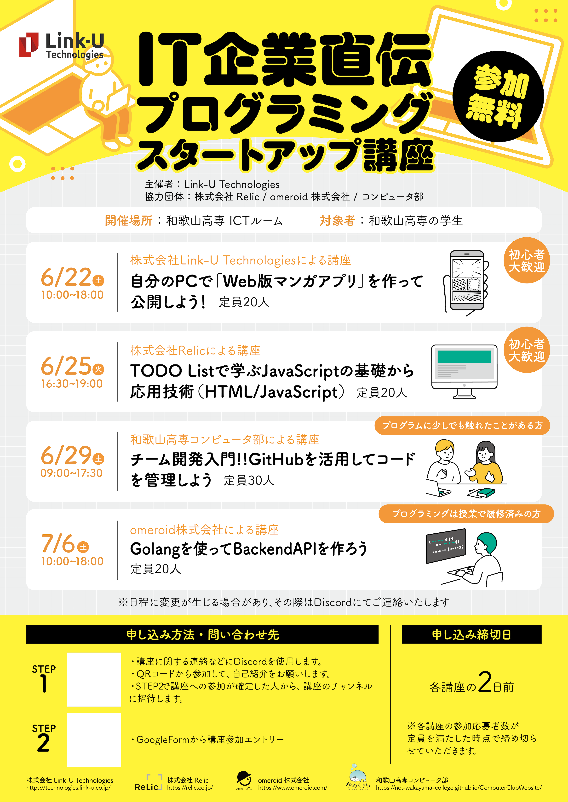

+++
title = 'プログラミング講座を開催！'
date = 2024-06-29T19:08:27+09:00
description = ''
categories = 'news'
tags = ['勉強会']
author = ['KashiuchiSotaro']
+++

6月29日(土曜日)の午前9時から午後17時の間にプログラミング講座を実施しました。  
この講座はLink-U Technologiesさんが主催する「IT企業直伝プログラミングスタートアップ講座」の一つとして実施しました。  

休日にも関わらず参加いただいた皆さん、お疲れ様でした。  
少しでも今後の開発の参考になれば幸いです。  

  

写真は受講生がハンズオンとして共同で開発を行ったリポジトリのグラフ
