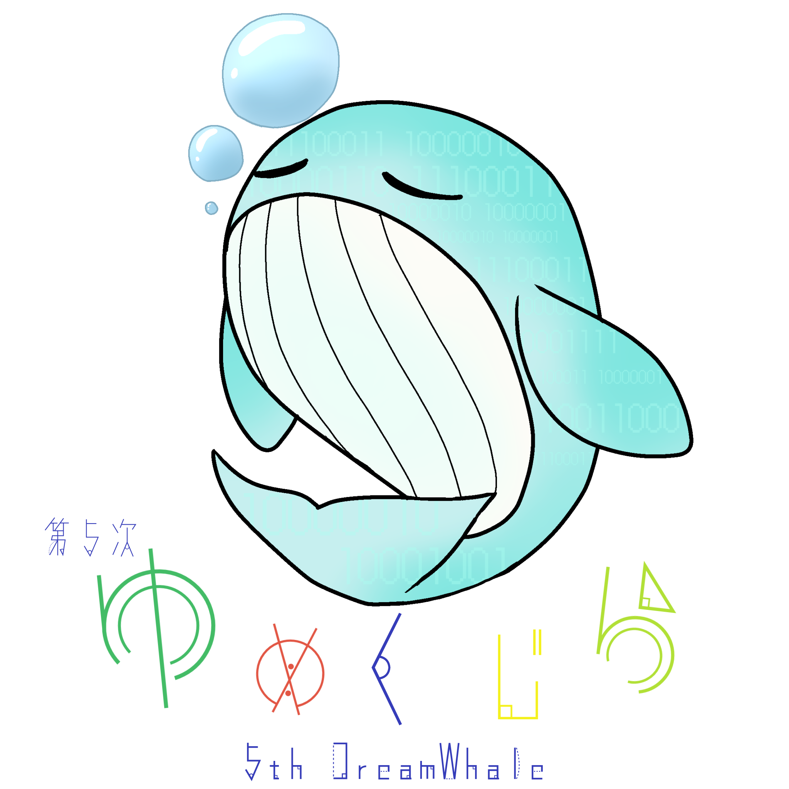

+++
title = '第5次ゆめくじら 発足'
date = 2024-09-30T22:00:00+09:00
description = ''
categories = 'news'
tags = ['クラブ体制']
author = ['KashiuchiSotaro']
+++

## 第5次ゆめくじら
本日、9月30日から夏休みが明け、後期が始まりました。
それにともない、第5次ゆめくじらへと世代交代しました。  
ゆめくじらの役職は以下のとおりです。

| 役職               | 名前               |
| ------------------ | ------------------ |
| 主将               | 樫内蒼太朗         |
| 副主将             | 狗巻友祐           |
| 会計               | 福本浩成           |
| 企画委員           | 播磨聡士           |
| 広報委員           | 巻渕友慎           |
| ゆめくじらメンバー | 川本彩智、下吉悠太 |

また、ゆめくじらメンバーの川本さんが「第5次ゆめくじら」のロゴを作ってくれました！  
とても素敵なロゴです！！

## 意気込み！
ゆめくじらのメンバーに意気込みや豊富を聞いてみました！

**「意気込みや豊富を聞かせてください」**  
私は策定にも関わらせてもらったコンピュータ部の1つ目のミッションを実現したいです。
> 「初めの一歩をサポートして、お互いに刺激しあい、モチベーションを維持できるコミュニティになる。最終的に、独学し成長できる人間になることを目標とする。」現在インターネットが普及し、誰もが自由に学べる時代になりました。独学できる人は自分でどんどんと成長することが可能であり、無限の可能性を秘めています。

ミッションにもある通り、独学で勉強できる人は最強だと考えています。私達ゆめくじらは独学で勉強するのに必要な機材や教材などの金銭面でのサポートを行ったり、視野を広げるためにLT会や交流会を実施したりしていきたいと考えています。

**「どんなゆめくじにしたいですか？」**  
ゆめくじらは、コンピュータ部をまとめる主将・副主将、予算の管理を行う会計、LT会や勉強会・交流会の企画を行う企画委員、Webサイトの更新やSNSの運用を行う広報委員、様々な視点から意見やサポートを行うゆめくじメンバーで構成されています。それぞれの役職に伴い基本的に役割を分担しています。  
しかし意見や案を出すときは役職に関わらずに、ゆめくじらのメンバー同士で積極的に意見を交流し、よりよいコンピュータ部へと目指していきたいです！

**「どんなコンピュータ部にしたいですか？」**  
どんどん盛り上げていき、とにかく楽しく自由な部活にしたいです。部門を超えて交流できると更に良いかなと思います。

**「企画委員としてどんなことをしたいですか？」**  
企画委員として、これまでの企画を引き継いだり、楽しい企画を企画していきたいと考えています。また企画委員が企画するだけではなく、部員が企画を提案しやすいような雰囲気を作っていきたいです！

**「最後に一言おねがいします！」**  
部員の皆さんにはご迷惑おかけするかもしれませんが、温かい目で見守ってください。  
よろしくおねがいします！！  
コンピュータ部を全員で盛り上げていきましょう！！！
