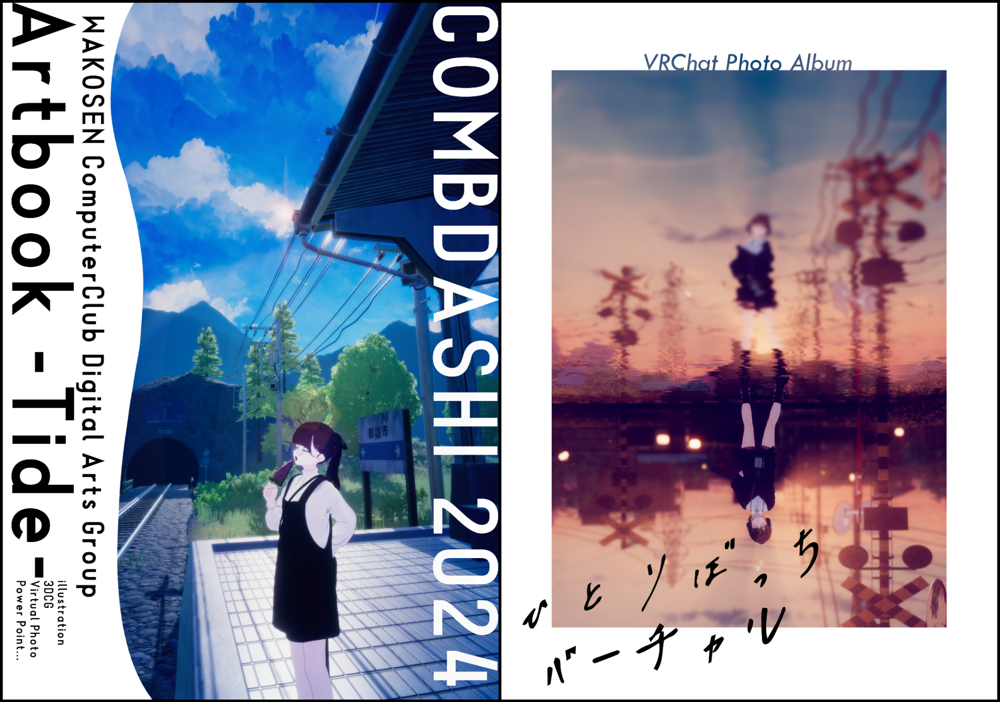
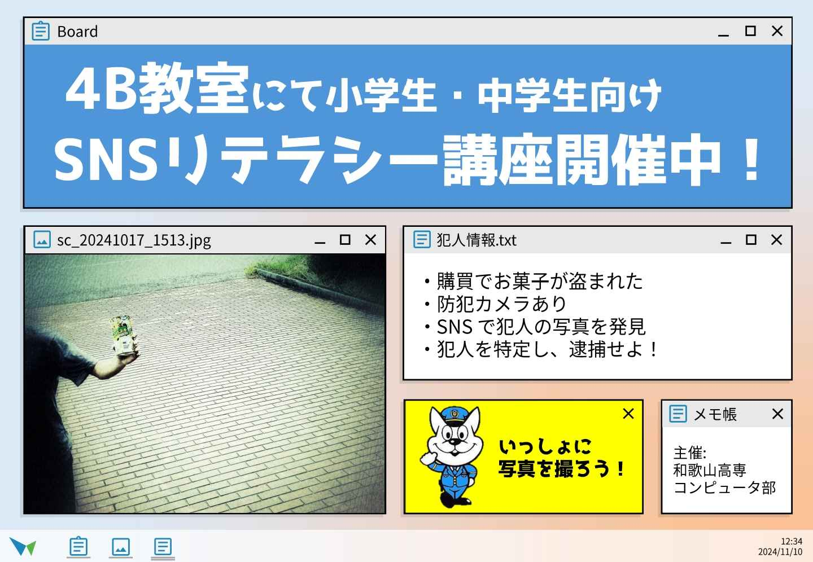

+++
title = '高専祭の見どころ特集！'
date = 2024-11-01T00:00:00+09:00
description = ''
categories = 'news'
tags = ['イベント', '高専祭']
author = ['KashiuchiSotaro']
+++

## 高専祭
今年もコンピュータ部は様々なイベントを開催するので、ぜひ高専祭に来てください！！！  

## 1.コンピューター部展示会
同人誌、ゲーム、動画、イラスト等を展示します！  
バーチャル部長「和歌宮らみなちゃん」と、ゆめくじら公式キャラクター「夢見ほえるちゃん」の等身大パネルもあります！  

## 2.ゆめくじらプログラミングコンテスト2024
コンピュータ部が協力、株式会社Link-U Technologies様が開催する「ゆめくじらプログラミングコンテスト」も実施しています。  
コンテストの最優秀賞は皆さんの投票で決まります！
またスタンプラリーも開催しています！！

[コンテストプレスリリース (PR Times)](https://prtimes.jp/main/html/rd/p/000000084.000038982.html)

## 3.SNSリテラシー講座
サイバー防犯ボランティアの一員として、和歌山県警察とのコラボ企画でSNSの利用方法について広報啓発活動を行います。SNSの怖さを体験できるブースを用意しているので、ぜひ体験しに来てください。  
11月9日と10日の10時30分、13時00分、14時から30分間の間に体験していただけると、きしゅう君と一緒に写真撮影もできます！
