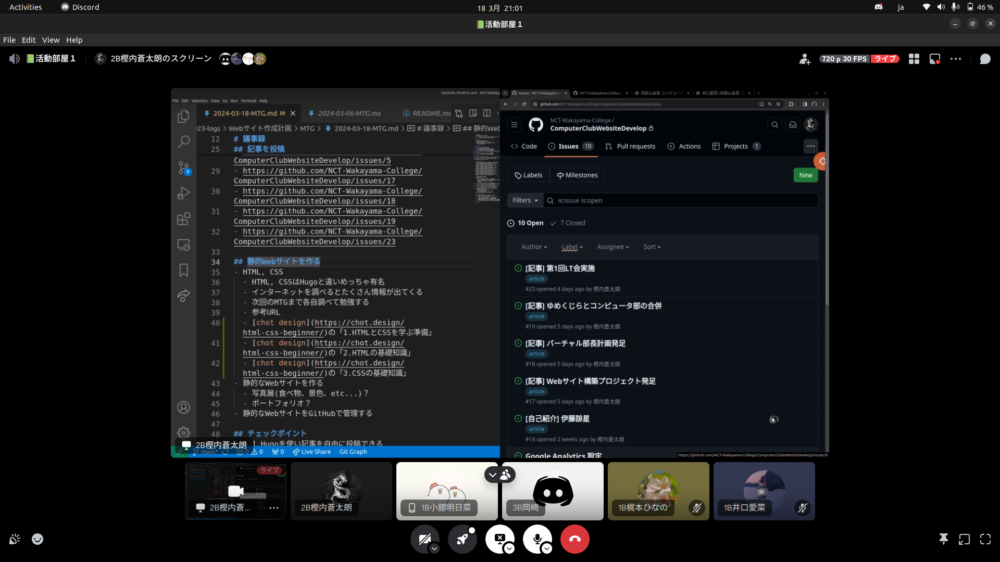
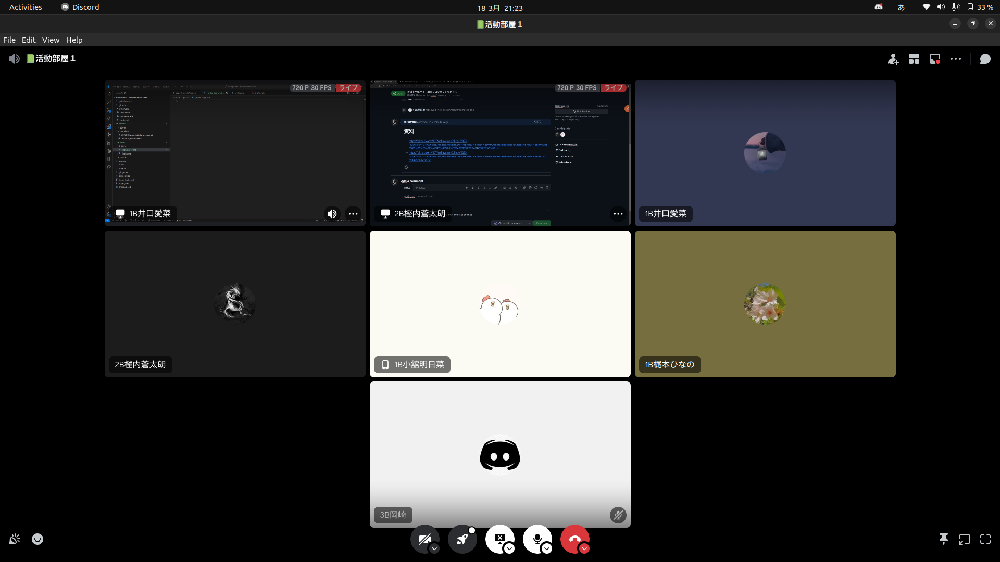

+++
title = 'WEBサイト構築プロジェクト発足'
date = 2024-03-18T21:52:53+09:00
description = 'コンピュータ部のWebサイトを構築するプロジェクト'
categories = 'news'
tags = ['website']
author = ['IguchiAina','KodateAsuna','KajimitoHinano']
+++

コンピュータ部では、新たにコンピュータ部のWebサイトを構築するプロジェクトが始まりました。
外部の方にコンピュータ部を知ってもらうこと、コンピュータ部のデザインアート部や、動画作成部が作成した作品を公開する場所を提供すること、Web技術に学ぶきっかけとなることなどを目的として発足しました。

### メンバー
樫内、岡崎、井口、梶本、小舘、巻渕、伊藤

### 活動内容
webサイトの仕組みを勉強し、GitHubやVSCodeを用いてwebサイトを開発しています。

ミーティング中の様子

